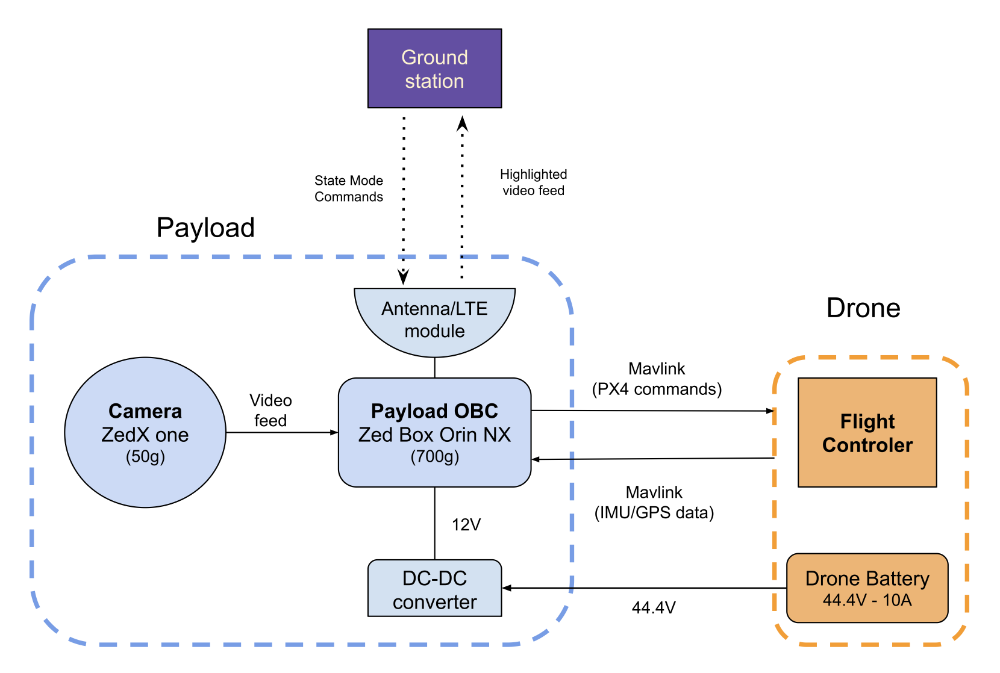
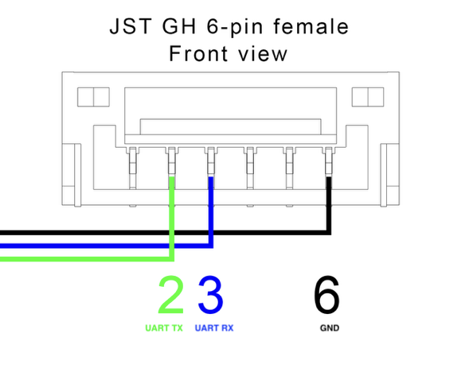

# Current Payload

### Objective

Our payload need to meet the following objectives:
- Send flight commands to the drone's flight controller
- Receive Telemetry from the drone
- Record a high quality video feed, and process it on board
- Communicate to the ground station
    - Receive commands from the ground station
    - Send telemetry and processed video feed to the ground station

The design is composed of:
- On Board Computer
- A depth Camera
- A DC-DC converter
- A communication antenna

## On Board Computer (OBC)

[Jetson Orin NX](https://www.mouser.com/datasheet/2/1520/Datasheet_ZED_Box_ORIN_NX_16GB_Oct_2023-3498637.pdf?srsltid=AfmBOoqKR41XMwAo-iteWCHb0Zu94958v8EqpUFCNUMzAVufoOk4ZJss)
    
This OBC was chosen because:
- It is integrated (ready to use)
- It enable On-board AI capabilities
- It unleashes the full capabilities of the Zed X camera

## Depth Camera

[Zed X One](ZEDXOne_Datasheet.pdf)

This Camera offers processing features, and is high quality (4K), with a wide field of view.

Unfortunately the lense is scratched. Therefore the video is a bit blurry. It may be possible to change the lense or remove it.

## DC_DC converter

The role of the DC-DC converter, is to convert the voltage of the Drone's battery to the voltage to power the OBC.

In our current setup, the payload is attached to the Freefly Alt X Ultra whose battery voltage is around 44V while the OBC requires a voltage between 12-19V.

[SD-150C-12](https://assets.rs-online.com/image/upload/v1698764518/Datasheets/80e7c5fc5ec1ff9609f04ff5ed22a508.pdf?_gl=1*zt3xx0*_gcl_aw*R0NMLjE3NzQzMDU3OTAuQ2p3S0NBand5WVBPQmhCeEVpd0FncFQ4UDZ6dlYwd05zS2VmODlrOE02Yjk5M090RV9xSUc3Zi1kOWRuOVBHVEdkenI1N3BhOEZRMV9Sb0MwdFVRQXZEX0J3RQ..*_gcl_dc*R0NMLjE3NzQzMDU3OTAuQ2p3S0NBand5WVBPQmhCeEVpd0FncFQ4UDZ6dlYwd05zS2VmODlrOE02Yjk5M090RV9xSUc3Zi1kOWRuOVBHVEdkenI1N3BhOEZRMV9Sb0MwdFVRQXZEX0J3RQ..*_gcl_au*MTU2Mjc0MzQxLjE3NzI1NjE4OTM.)

This DC converter can receive voltages from 36-72V and convert it into 12V. It can supply up to 150W of power and weight 860g.

## Communication Antenna

The communication antenna was provided by MCity, we don't have the specs yet.

It is composed of two parts, an omnidirectional ground station antenna and a small omnidirectional antenna attached to the drone. 

On the payload's point of you, it is like the payload was directly connected to the wifi of the ground station.

## Structure 
The structure is 3D-printed from PETG to ensure robustness under heat loads (from the electronics)

## Interfaces
### Electrical (wiring)

The OBC need to be connected to antenna:
- Ethernet cable between the OBC and the antenna

The OBC need to be connected to the camera:
- FAKRA Z cable Female to Female - 1-to-4

The drone battery need to power the DC-DC converter
- XT30 male cable that plug into the drone, and the other end of the wire is screwed into the DC-DC converter

The DC-DC connector need to power the OBC
- Cables are screwed into the DC-DC converter and the other end is soldered on a [DC barrel jack 761KS12](https://www.mouser.com/datasheet/3/144/1/761KS_767KS_S761KS_CD.pdf)

The OBC need to communicate to the drone (UART)
- A USB to UART cable ([TTL-234X-
3V3-WE](https://www.mouser.com/datasheet/3/35/1/DS_TTL234X%20SERIES%20RANGE%20OF%20CABLES.pdf)) soldered to a [JST GH 6 female](https://www.amazon.com/Pre-Crimped-Connectors-Pixhawk2-Pixracer-Silicone/dp/B07PBHN7TM/ref=sr_1_1_sspa?dib=eyJ2IjoiMSJ9.bmfy9ZRunFzSTalouCeXlXDSVRe12Id17z7Pt1oRc5uhtNEMdxHbis_eoZ0ayqEfkCxLW507G1Vp1WNu4nF4wpMK3vn1kYtTYAP_z9n3nSUEQeysANGJChobFNmnhIOeEF5TIvca5dQB_09k6-BsEcSYJc_S-EOLUeolvGauUmg8Y7IAV7ERRJXYgDwBrJb4desPrFLQo_CXd8gO_V-TYhKOx8GPYqaSumVv5OrLHaWWXiCEy0h67R6L9QYTvMe07DFv7VDmUKiTkid-fU-Gz8M8HQv29kuSpBjdVtZ4QoQ._JImBKBDcrq2BmUsXt-EfHDyH3kx6fKetfV8oqv3z3U&dib_tag=se&keywords=JST+GH+kit&qid=1774982119&sr=8-1-spons&sp_csd=d2lkZ2V0TmFtZT1zcF9hdGY&psc=1)
- Only 3 cables need to be connected:
    - GND
    - UART RX with Drone TX
    - UART TX with Drone RX

    The following image depicts where to connect the cables on the JST GH connector. The orientation is misleading, I found out that the diagram is a view from the side the cables are slipped into the connector. You can verify it on the drone by using a multimeter and finding the GND position, and therefore the overall orientation.

    

- The USB is plugged into the OBC and the JST GH is plugged into the drone

